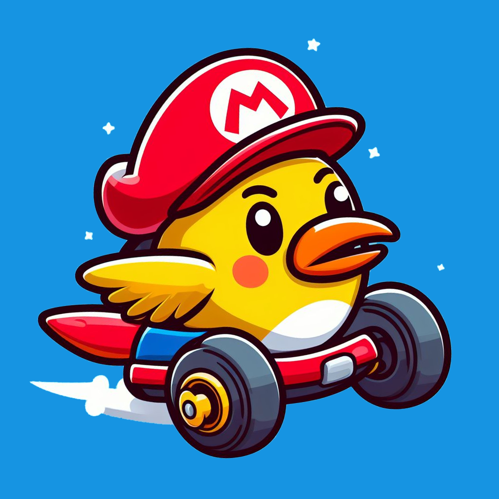

# Flappy Mario Kart Bird 64

.cht)

A mode for Mario Kart 64 based on Flappy Bird. Try and finish one lap without touching the ground... by feather jumping the entire track! 

Works in all racing modes and up to 4 players.

## Controls 
Steer - Analog Stick  
Feather Jump - Z  

Nothing else, it's that simple you can even play one handed.

## How to use

Download the [cheat file](Mario%20Kart%2064%20(U).cht) for use with Project64, or manually add the cheats to your emulator of choice. These are GameShark codes so should be compatible with anything that accepts them.

Pick Mario GP or VS Mode and race away!

## GameShark Codes Explained

This involved quite a lot of codes so I won't do a full explanation but essentially it's a combination of auto-accelerate, moon gravity and feather jump codes to make it control like Flappy Bird. Then a fail state assigned to players if they hit the ground, in this case the "Frost" and "Smoking" state for a clear visual indicator that the player has failed. It's not perfect but it works! As there are so many codes to help setup this mode I have left them separated in the .cht file for easy access and readability.

## Issues

* There are some oddities, mostly in Mario GP mode. For example players start above the finish line (which doesn't happen in VS) and a couple of tracks won't start (Bowser's Castle in Star Cup)

* The following is an issue but it also serves as a constraint on the player to stop them from excessive feather jumping (which would make the game too easy). Go too high or too far away from the track and it will stop the game from loading the track! You will instead be greated by a black void. Unfortunately this is unavoidable in some tracks (Banshee Boardwalk) but if you know the tracks well enough, you may still be able to navigate it even without being able to see the ground beneath you.
